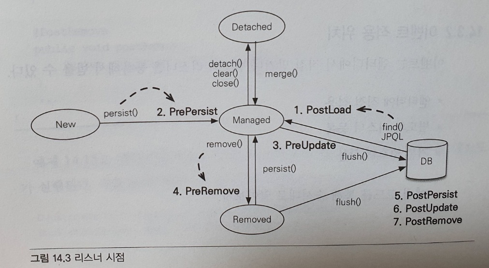

# 컬렉션과 부가 기능
- 컬렉션, 컨버터, 리스너, 엔티티 그래프에대해 알아본다.

### 1. 컬렉션
- JPA는 자바가 기본으로 제공하는 Collection, List, Set, Map 컬렉션을 지원한다.
- @OneToMany, @ManyToMany에서나 @ElementCollection을 사용하여 값 타입을 하나 이상 보관할 때 주로 사용한다.
- Collection: 자바의 최상위 컬렉션, 하이버네이트에서는 중복은 허용하고 순서는 없는 집합체
- List: 중복은 허용하나 순서가 있는 집합체
- Set: 중복을 허용하지 않고 순서를 보장하지 않는 집합체
- Map: key value 쌍
- Map은 활용도가 떨어진다. 사용 시 @MapKey* 를 사용하면된다

#### 1) JPA와 컬렉션
- 하이버네이트는 엔티티를 영속상태로 만들 때 컬렉션 필드를 하이버네이트에서 준비한 컬렉션으로 한 번 감싼다.
- ArrayList를 영속상태로 만들고 클래스를 출력해보면 PersistentBag으로 변겨오딘다.
- 하이버네이트는 컬렉션을 효율적으로 관리하기 위해 내장 컬렉션을 생성하여 사용하도록 한다.
- 이러한 특징 때문에 컬렉션들은 즉시 초기화하는것을 권장한다.

**Collection, List**
- 중복을 허용하나 순서는 없는 래퍼 컬렉션인 PersistentBag으로 깜사게 된다.
- 보통 이 인터페이스는 ArrayList로 초기화하면 된다.
- 중복을 허용하므로 add 메서드는 항상 true를 반환하고, 동일 엔티티를 찾거나 삭제할 때는 equals를 사용한다.
- 즉 이 둘은 엔티티 추가 시 중복 엔티티를 비교하지 않고 단순히 저장만 한다.
- 그렇기 때문에 엔티티를 추가해도 지연 로딩된 컬렉션을 초기화하지 않는다.

<br>

**Set**
- PersistentSet을 컬렉션 래퍼로 사용한다.
- 보통 이 인터페이스는 HashSet으로 초기화 하면된다.
- Set은 중복을 허용하지 않으므로 엔티티를 추가할 때마다 값을 비교하여야 한다.
- add시 같은 객체가 있으면 false, 없으면 추가 후 true를 반환한다.
- hash알고리즘을 사용하므로 hashcode와 함께 비교를 시행한다.
- set은 중복 엔티티를 검사하여야 하므로 엔티티 추가 시 지연 로딩 컬렉션이 초기화 된다.

<br>

**List + @OrderColum**
- @OrderColum을 사용하면 순서가 있는 특수한 컬렉션으로 인식하게 된다.
- 즉 데이터베이스에 순서 값을 저장해서 조회할 때 사용한다는 의미이다.
- PersistentList를 컬렉션 래퍼로 사용한다.
- @OrderColum(name = "POSITION") 이런식으로 사용한다.
- 애노테이션 설정인 일인곳에서 하지만 실제 POSITION데이터는 다 테이블에 저장된다.
- 중간에 값을 넣으면 한 칸씩 땡겨야 하므로 쿼리 많이 날리고, 중간 데이터 삭제하면 해당 위치에 대한 값 null되고 여러모로 단점이 많으므로 그냥 orderby를 사용하자!

**OrderBy**
- 이 방법은 데이터베이스의 ORDER BY절을 사용해서 컬렉션을 정렬한다.
- 그러므로 순서용 컬럼을 따로 매핑할 필요가 없다.
- OrderBy("username desc, id asc") 이런식으로 사용하면 된다.
- 얘를 사용하면 하이버네이트는 순서 유지를 위해 HashSet대신 LinkedHashSet을 내부에서 사용한다.

### 2. @Converter
- 컨버터를 사용하면 엔티티의 데이터를 변환해서 데이터베이스에 저장할 수 있다.

```java
import javax.persistence.AttributeConverter;

public class BooleanToYNConverter implements AttributeConverter<Boolean, String> {
    @Override
    public String convertToDatabaseColumn(Boolean attribute) {
        return (attribute != null && attribute) ? "Y" : "N";
    }
    @Override
    public Boolean convertToEntityAttribute(String dbData) {
        return "Y".equals(dbData);
    }
}
```
- 만약 true, false를 Y, N으로 변경해주는 컨버터가 있을 때 아래와같이 설정을 할 수 있다.

```java
@Convert(converter = BooleanToYNConverter.class)
private boolean vip;
```

<br>

```java
@Convert(converter = BooleanToYNConverter.class, attributeName = "vip")
public class Member {

}
```
- 혹은 이렇게 클래스 레벨에서도 설정할 수 있다.

```java
@Converter(autoApply = true)
public class BooleanToYNConverter implements AttributeConverter<Boolean, String> {

}
```
- 글로벌 설정을 하고 싶을 때는 이렇게 설정하면 된다
- 단 컨버터에 설정 했을 때는 boolean 타입에 대한 모든 데이터에 컨버터가 적용된다.
- 글로벌 컨버터나 상속 받은 컨버터를 사용하고 싶지 않을 때는 @Converter(disableConversion)을 사용하자.

### 3. 리스너
- 모든 엔티티를 대상으로 언제 어떤 사용자가 삭제를 요청했는지 모두 로그를 남겨야 하는 요구사항이 있다고 가정하자.
- 이때 애플리케이션 삭제 로직을 하나씩 찾아 로그를 남기는 것은 비효율적이다.
- 이럴때 JPA리스너 기능을 활용하면 엔티티 생명주기에 따른 이벤트를 처리할 수 있다.

#### 1) 이벤트 종류


1. PostLoad: 엔티티가 영속성  컨텍스트에 조회된 직후 또는 refresh를 호출한 후(2차 캐시에 저장되어 있어도 호출한다)
2. PrePersist: persist() 메소드를 호출해서 엔티티를 영속성 컨텍스트에 관리 하기 직전에 호출한다.
3. PreUpdate: flush나 commit을 호출해서 엔티티를 데이터베이스에 수정하기 직전에 호출한다.
4. PreRemove: remove() 메서드를 호출해서 엔티티를 영속성 컨텍스트에서 삭제하기 직전에 호출된다. 또는 삭제 명령어로 영속성 전이가 일어날 때도 호출된다. orphanRemoval에 대해서는 flush나 commit시에 호출된다.
5. PostPersist: flush나 commit을 호출해서 엔티티를 데이터베이스에 저장한 직후에 호출된다. 식별자가 항상존재한다. **참고로 식별자 생성 전략이 IDENTITY면 식별자를 생성하기 위 persist()를 호출하면서 데이터베이스에 해당 엔티티를 저장하므로 이때는 persist()를 호출한 직후에 바로 PostPersist가 호출된다.**
6. PostUpdate: flush나 commit을 호출해서 엔티티를 데이터베이스에 수정한 직후에 호출된다.
7. PostRemove: flush, commit을 호출해서 엔티티를 데이터베이스에 삭제한 직후에 호출된다.

#### 2) 이벤트 적용 위치
- 이벤트는 엔티티에서 직접 받거나 별도의 리스너를 등록해서 받을 수 있다.
- 대표적으로 1) 엔티티에 직접 적용, 2)별도의 리스너 등록, 3)기본 리스너 사용이 있다.

**엔티티에 직접 적용**
```java
@Entity
public class Duck {

    @Id @GeneratedValue
    private Long id;

    private String name;

    @PrePersist
    public void prePersist(){
        System.out.println("prePersist id=" + id);
    }

    @PostLoad
    public void postPersist(){
        System.out.println("postPersist id=" + id);
    }
}
```
- prePersist는 생성전이므로 id=null이다.
- postPersist는 생선 후 이므로 id=1이다.


**별도의 리스너 등록**
```java
public class DuckListener {

    @PrePersist
    // 타입 확실 시 특정 타입을 받을 수 있다.
    private void prePersist(Object obj){
        System.out.println("prePersist obj = " + obj);
    }

    @PostPersist
    // 타입 확실 시 특정 타입을 받을 수 있다.
    private void postPersist(Object obj){
        System.out.println("postPersist obj = " + obj);
    }

}

@Entity
@EntityListeners(DuckListener.class)
public class Duck {
}
```

- Listener를 따로 만든 후 EntityListeners로 등록하면 된다.

**기본 리스너 사용**
- 모든 엔티티에 적용하기 위해 META-INF/orm.xml에 기본 리스너로 등록하면된다.

```xml
<?xml version="1.0" encoding="UTF-8" ?>
<entity-mappings xmlns="http://java.sun.com/xml/ns/persistence/orm" version="2.0">
    <persistence-unit-metadata>
        <persistence-unit-defaults>
            <entity-listeners>
                <entity-listener class="me.sun.springquerydsl.entity.DefaultListener"/>
            </entity-listeners>
        </persistence-unit-defaults>
    </persistence-unit-metadata>
</entity-mappings>
```

> 리스너 등록 순서는 1) 기본 리스너, 2) 부모 클래스 리스너, 3) 리스너, 4)엔티티가 있다.

**더 세밀한 설정**

```java
@Entity
@EntityListeners(DuckListener.class)
@ExcludeDefaultListeners // 기본 리스너 무시
@ExcludeSuperclassListeners // 상위 클래스 이벤트 리스너 무시
public class Duck extends BaseEntity{
}
```

### 4. 엔티티 그래프
- 엔티티 그래프 기능은 엔티티 조회시점에 연관된 엔티티들을 함께 조회하는 기능이다.
