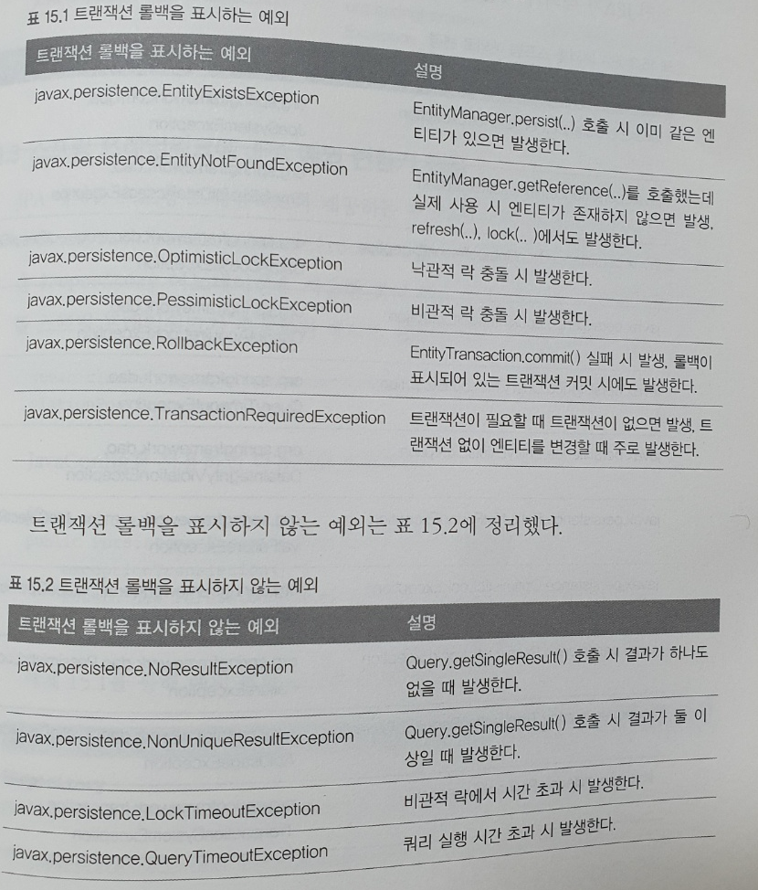
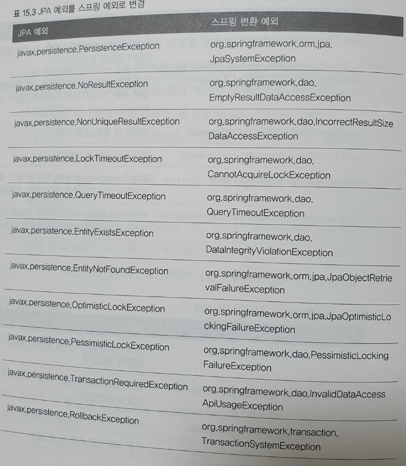

# 고급주제와 성능 최적화
- 예외처리: JPA 사용 시 발생하는 다양한 예외와 예외에 따른 주의점 설명
- 엔티티비교: 엔티티를 비교할 때 주의점과 해결방법을 설명한다.
- 프록시 심화 주제: 프록시로 인해 발생하는 다양한 문제점과 해결 방법을 다룬다.
- 성능최적화: N+1문제 , 읽기 전용 쿼리 성능 최적화, 배치 처리, SQL 쿼리 힌트 사용, 트랜잭션 쓰기 지연 최적화

### 1. 예외처리
#### 1) JPA 표준 예외 정리
- JPA표준 예외들은 javax.persistence.PersistenceException의 자식들이다.
- 따라서 JPA 예외는 모두 언체크 예외이다.
- JPA 표준 예외는 크게 1) 트랜잭션 롤백을 표시하는 예외, 2) 트랜잭션 롤백을 표시하지 않는 예외이다.
- 트랜잭션 롤백을 표시하는 예외는 심각한 예외이므로 복구해선 안된다.
- 이 예외가 발생하면 트랜잭션을 강제로 커밋해도 커밋되지 않고 RollbackException이 발생한다.
- 반면 트랜잭션 롤백을 표시하지 예외는 심각한 예외가 아니므로 개발자가 판단하면 된다.



#### 2) 스프링 프레임워크의 JPA 예외 변
- 서비스 계층에서 데이터 접근 계층의 구현 기술에 직접 의존하는 것은 좋은 설계라 할 수 없다.
- 이것은 예외도 마찬가지이다. 예를 들어 서비스 계층에서 JPA의 예외를 직ㅈ버 사용하면 JPA에 의존하게 된다.
- 스프링 프레임워크는 이런 문제를 해결하려고 데이터 접근 계층에 대한 예외를 추상화해서 개발자에게 제공한다.
- 어떤 JPA 예외가 어떤 스프링 예외로 변환되는지 아래에 정리되어 있다.


- 추가적으로 IllegalStateException을 InvalidDataAccessApiUsageException으로
- IllegalArgumentException을 InvalidDataAccessApiUsageException으로 변경해준다.

#### 3) 스프링 프레임워크에 JPA 예외 변환기 적용
- JPA 예외를 스프링 프레임워크가 제공하는 추상화된 예외로 변경하려면 PersistenceExcpetionTranslationPostProcessor를 스프링 빈으로 등록하면 된다.
- 이것은 @Repository 애노테이션을 사용한 곳에 예외 변환 AOP를 적용해서 JPA 예외를 스프링 프레임워크가 추상화환 예외로 변환해준다.

```java
@Bean
public PersistenceExceptionTranslationPostProcessor exceptionTranslation(){
    return new PersistenceExceptionTranslationPostProcessor();
}
```
- 간단하게 자바로 빈으로 등록 가능하다.

```java
@Repository
class TempRepository{

    public Member findMember() //throws NoResultException
    {
      // 예외 발생  
    }
}
```
- 만약 예외가 발생하면 PersistenceExceptionTranslationPostProcessor에서 등록한 AOP 인터셉터가 발동해 해당 예외를 스프링이 추상화한 예외로 변경하여 던져준다.
- 예외를 변환하지 않으려면 주석처리된 부분을 사용하면된다.

#### 4) 트랜잭션 롤백 시 주의사항
- 트랜잭션을 롤백하는 것은 데이터베이스의 반영사항만 롤백하는것이지 수정한 자바 객체까지 원상태로 복구해주지는 않는다.
- 즉 em.clear()로 영속성 컨텍스트를 초기화해주어야 한다.
- 스프링에서는 이런 문제를 예방하기 위해 영속성 컨텍스트의 범위에 따라 다른 방법을 사용한다.
- 기본 전략인 트랜잭션당 영속성 컨텍스트 전략은 문제가 발생하면 트랜잭션 AOP 종료 시점에 트랜잭션을 롤백하면서 영속성 컨텍스트도 함께 종료하므로 문제가 발생하지 않는다.
- 문제는 OSIV처럼 영속성 컨텍스트의 범위를 트랜잭션 범위보다 넓게 사용해서 여러 트랜잭션이 하나의 영속성 컨텍스트를 사용할 때 발생한다.
- 이때는 트랜잭션을 롤백해서 영속성 컨텍스트에 이상이 발생해도 다른 트랜잭션에서 해당 영속성 컨텍스트를 그대로 사용하는 문제가 있다.
- 스프링에서는 영속성 컨텍스트의 범위를 트랜잭션의 범위보다 넓게 설정하면 트랜잭션 롤백시 영속성 컨텍스트를 초기화(em.clear())해서 잘못된 영속성 컨텍스트를 사용하는 문제를 예방한다.

### 2. 엔티티 비교
- 1차 캐시와 영속성 컨텍스트와 생명주기를 같이 한다.
- 영속성 컨텍스트를 더 정확히 이해하기 위해서는 1차 캐시의 가장 큰 장점인 **애플리케이션 수준의 반복 가능한 읽기** 를 이해해야 한다.
- 보통 1차캐시 데이터는 동등성(equals)수준이 아닌 같은 참조 동일성(==) 수준까지 같은 인스턴스를 반환한다.
- 동등성(identical)은 == 비교, 동일성(equinalent)는 equals비교, 데이터베이스 동등성은 @Id인 데이터베이스 식별자가 동일한 것

> 테스트, 서비스 두곳 모두에 @Transactional이 있다면 기본 전략은 먼저 시작된 트랜잭션을 이어받아 사용한다.
@Transactional(propagation = REQUIRED)이 기본값이다. 스프링 문서에 자세히 나와 있다.

> 테스트코드는 트랜잭션을 플러시하지 않고 롤백하므로 플러시 결과를 알고싶으면 em.flush를 따로 호출하자.

#### 1) 영속성 컨텍스트가 같을 경우
- 예를들어 테스트코드에도 트랜잭셔녈이 붙어있다면 해당 코드 내에서는 같은 영속성 컨텍스트이므로 1차캐시가 적용되어 참조까지 같은 데이터를 반환하게 될 것이다.

#### 2) 영속성 컨텍스트가 다를 경우
- 만약 테스트코드에 트랜잭셔녈을 때고 서비스는 당연히 붙어잇을 것이고 리포지토리도 해당 기능확인을위해 트랜잭셔녈을 붙인다.
- 테스트코드에서 맴버를 조회할 때 트랜잭션이 걸리고 해당 서비스 호출이 끝나면 트랜잭션이 종료된다.
- 그리고 또 멤버를 찾을 때 트랜잭션이 새로 걸리기 때문에 서로다른 영속성 컨텍스트를 가진다.
- 이때 비교를하면 해당 데이터들은 같지만 참조는 다르게 된다.

> 그러므로 영속성 컨텍스트가 다를 경우는 다른 방식으로 엔티티를 비교하여야한다.

- member.getId().equals(findMembet.getId()) 이렇게 데이터베이스 식별자로 비교하여도 되지만 이 데이터는 엔티티를 영속화하여야 식별자를 얻을 수 있다.
- **eqauls()를 사용한 동등성 비교를 하는것이 좋다, 비즈니스 키를 활용하여 동등성을 비교해보자**
- 여기서 비즈니스 키는 보통 중복되지 않고 거의 변하지 않는 데이터베이스 기본 키 후보들이 좋은 대상이다.
- 주민번호정도가 좋은 예시일 것이다.

### 3. 프록시 심화주제
- 프록시는 원본 엔티티를 상속받아서 만들어지므로 엔티티를 사용하는 클라이언트는 엔티티가 프록시인지 아니면 원본 엔티티인지 구분하지 않고 사용할 수 있다.
- 그렇기 때문에 지연 로딩을 사용하여 원본 엔티티를 프록시로 변경해도 비즈니스 로직을 수정하지 않아도 된다.
- 하지만 이에따른 문제들도 발생한다.

#### 1) 영속성 컨텍스트와 프록시
```java
Member member1 = em.getReference(Member.class, "member");

Member member2 = em.find(Member.class, "member");

member1 == member2 // true
```
- 만약 프록시로 먼저 조회한다면 뒤의 em.find도 프록시가 조회된다.
- 영속성 컨텍스트의 엔티티의 동일성을 꼭 보장해야하기 때문에 이렇게 보장시켜준다.

```java
Member member2 = em.find(Member.class, "member");

Member member1 = em.getReference(Member.class, "member");

member1 == member2 // true
```
- 만약 원본 엔티티를 먼저 조회하면 프록시를 조회할 때 원본 엔티티를 조회하게 된다.
- 이 또한 영속성 컨텍스트에서 엔티티의 동일성을 보장해주기 위해서이다.

#### 2) 프록시 타입 비교
- 만약 프록시와 원본 객체를 비교해야할 때는 instanceof를 사용하면 된다.
- 왜냐하면 프록시는 원본 엔티티를 상속받아서 만들게 된다.

#### 3) 프록시 동등성 비교
- 엔티티의 동등성은 비즈니스 키를 사용해서 equals 메서드를 오버라이딩하고 비교하면 된다.
- 그러나 IDE나 외부 라이브러리를 사용해서 구현한 equals() 메서드로 엔티티를 비교할 때 프록시라면 문제가 발생할 수 있다.

```java
// 똑같은 애를 저장함...

Member newMember = new Member("member1", "회원1");
Member refMember = getReference();

newMemeber.equals(refMember);

public boolean equals(Object obj){
  if(this == obj) return true;
  if(obj == null) return false;

  // 1
  if(this.getClass() != obj.getClass()) return false;

  Member member = (Member) obj;

  // 2
  if(name != null ? !name.equals(member.name) : member.name != null)
  return false;

  return true;
}
```

- 1번에서 문제가 발생한다; 왜냐하면 프록시는 상속받은 자식이기 때문에 if(!(obj instanceof Member)) return false;로 변경하여야 한다.
- 2번에서도 문제가 발생한다. 왜냐하면 해당 값들은 프록시이고 name은 private이다. 그렇기 때문에 아무값도 조회할 수 없으므로 프록시.name을하게되면 null이 반환된다.
- member.name을 .getName()으로 변경해 주어야 제대로 동작한다.
