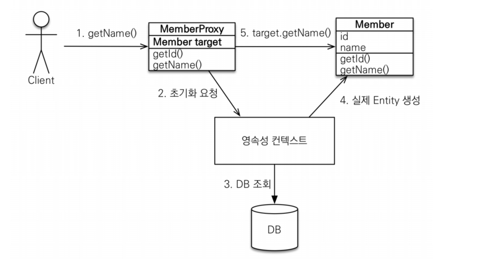

# JPA의 프록시

> 어떤 A와 B가 연관관계가 있을 때 A를 호출할 때 항상 B도 함께 호출되면 효율적이지 못하다. 이럴때 프록시를 활용하여 문제를 해결할 수 있다.

#### 예제 엔티티
```java
@Entity
@NoArgsConstructor(access = AccessLevel.PROTECTED)
@Getter
@Setter
public class Member extends BaseTimeEntity {

    @Id
    @GeneratedValue(strategy = GenerationType.IDENTITY)
    @Column(name = "member_id")
    private Long id;

    private String name;

    @ManyToOne
    @JoinColumn(name = "team_id")
    private Team team;
}

@Entity
@NoArgsConstructor(access = AccessLevel.PROTECTED)
@Getter
@Setter
public class Team {

    @Id
    @GeneratedValue
    @Column(name = "team_id")
    private Long id;

    private String teamName;

    @OneToMany(mappedBy = "team")
    private List<Member> members;
}
```

### em.find()
- em.find()로 조회하면 실제 데이터베이스에서 객체를 조회하게된다.

```java
Member m = new Member();
m.setName("Dexter");
em.persist(m);

em.flush();
em.clear();

Member findMember = em.find(Member.class, m.getId());

System.out.println("=================== 호출 전 ===================");
System.out.println("findMember.getClass() = " + findMember.getClass());
System.out.println("findMember.getName() = " + findMember.getName());
System.out.println("=================== 호출 후 ===================");
```

<br>

```sql

Hibernate:
    select
        생략..
    from
        Member member0_
    left outer join
        Team team1_
            on member0_.team_id=team1_.team_id
    where
        member0_.member_id=?
=================== 호출 전 ===================
findMember.getClass() = class blogJpa.Member
findMember.getName() = Dexter
=================== 호출 후 ===================
```

### em.getReference()
- em.getReference()로 조회하면 프록시로 조회하고 실제 그 객체의 값을 조회할 때 디비에서 값을 가져온다.

```java
Member m = new Member();
m.setName("Dexter");
em.persist(m);

em.flush();
em.clear();

Member findMember = em.getReference(Member.class, m.getId());

System.out.println("=================== 호출 전 ===================");
System.out.println("findMember.getClass() = " + findMember.getClass());
System.out.println("findMember.getName() = " + findMember.getName());
System.out.println("=================== 호출 후 ===================");
```

<br>

```sql
=================== 호출 전 ===================
findMember.getClass() = class blogJpa.Member$HibernateProxy$R59fkZqW
Hibernate:
    select
        생략....
    from
        Member member0_
    left outer join
        Team team1_
            on member0_.team_id=team1_.team_id
    where
        member0_.member_id=?
findMember.getName() = Dexter
=================== 호출 후 ===================
```
- findMember.getName()으로 값을 호출하기 바로전에 데이터가 조회되는것을 알 수 있다.

<br>

---

### 프록시의 특징
- 기존 프록시 패턴에 사용되는 프록시와 유사하다.
- 프록시 객체를 초기화할 때, 프록시 객체가 실제 엔티티로 바뀌는게 아닌 프록시를 통해 실제 엔티티에 접근하는 것
- 프록시 객체는 원본 엔티티를 상속받았으므로 == 비교는 실패할 것이며 instance of를 사용해야 한다.
- 영속성 컨텍스트에 이미 실제 엔티티가 있으면 getReference를 하여도 실제 엔티티가 조회된다.
- 준영속 상태에서 프록시를 통해 값을 가져오려고하면 에러가 발생한다.

### 프록시 객체의 초기화



<br>

- 1. Client가 getName()을 호출한다.
- 2. 호출받은 프록시가 영속성 컨텍스트에 초기화를 요청한다.
- 3. 영속성 컨텍스트에 이미 값이 있다면 바로 4번으로 갈테지만 그렇지 않다면 DB에 조회한다.
- 4. 조회된 데이터로 실제 엔티티를 생성한다.
- 5. 생성된 실제 엔티티를 프록시가 조회하여 반환해준다.


```java
System.out.println("=================== 호출 전 ===================");
System.out.println("findMember.getClass() = " + findMember.getClass());

System.out.println("findMember.getName() 첫번째 호출 = " + findMember.getName());
System.out.println("findMember.getName() 두번째 호출 = " + findMember.getName());
System.out.println("=================== 호출 후 ===================");
```
```sql
=================== 호출 전 ===================
findMember.getClass() = class blogJpa.Member$HibernateProxy$PnhnxVd7
Hibernate:
    select
        생략...
    from
        Member member0_
    left outer join
        Team team1_
            on member0_.team_id=team1_.team_id
    where
        member0_.member_id=?
findMember.getName() 첫번째 호출 = Dexter
findMember.getName() 두번째 호출 = Dexter
=================== 호출 후 ===================
```

- 출력을 확인해보면 두번째 호출에서는 아무 쿼리도 날라가지 않는다.
- 위에서 설명한 것처럼 이미 영속성 컨텍스트에 첫번쨰 호출때 값을 넣었기 때문에 DB에 조회하지 않고 바로 가져올 수 있는 것이다.

<br>

#### em.find ----> em.getReference

```java
Member findMember = em.find(Member.class, m.getId());
System.out.println("findMember.getClass() = " + findMember.getClass());

Member findMemberWithReference = em.getReference(Member.class, m.getId());
System.out.println("findMemberWithReference = " + findMemberWithReference.getClass());
```

<br>

```sql
Hibernate:
    select
        생략...
    from
        Member member0_
    left outer join
        Team team1_
            on member0_.team_id=team1_.team_id
    where
        member0_.member_id=?
findMember.getClass() = class blogJpa.Member
findMemberWithReference = class blogJpa.Member
```
- em.find로 먼저 조회하면 em.getReference로 조회하여도 실제 엔티티가 조회된다.


#### em.getReference ----> em.find

```java
Member findMember = em.find(Member.class, m.getId());
System.out.println("findMember.getClass() = " + findMember.getClass());

Member findMemberWithReference = em.getReference(Member.class, m.getId());
System.out.println("findMemberWithReference.getClass() = " + findMemberWithReference.getClass());
```

<br>

```sql
findMemberWithReference = class blogJpa.Member$HibernateProxy$N6hxopkK
Hibernate:
    select
        생략...
    from
        Member member0_
    left outer join
        Team team1_
            on member0_.team_id=team1_.team_id
    where
        member0_.member_id=?
findMember.getClass() = class blogJpa.Member$HibernateProxy$N6hxopkK
```
- em.getReference로 먼저 조회하면 em.find 조회하여도 프록시 객체가 조회된다.

> 이는 JPA가 똑같은 값을 조회하고 == 비교를하였을 때 항상 참으로 만들어 주기위해서 이다.

### 준영속 상태에서 프록시 초기화
```java
Member m = new Member();
m.setName("Dexter");
em.persist(m);

em.flush();
em.clear();


Member findMemberWithReference = em.getReference(Member.class, m.getId());
System.out.println("findMemberWithReference = " + findMemberWithReference.getClass());

// 준영속 상태 만들기
em.detach(findMemberWithReference);

System.out.println("findMemberWithReference.getName() = " + findMemberWithReference.getName());
```

<br>

```sql
org.hibernate.LazyInitializationException: could not initialize proxy [blogJpa.Member#1] - no Session
```
- 위의 프록시 특징에 나와 있듯이 준영속 상태일 때 프록시를 초기화하면 에러가 발생한다.
- 왜냐하면 실제 값을 가져올 때 영속성 컨텍스트에서 값을 확인 후 DB를 조회해야하는데 영속성 컨텍스트에 값이 없기 때문이다.

### 프록시 확인 및 초기화
프록시 인스턴스의 초기화 확인
- PersistenceUnitUtil.isLoaded(Object entity)
- 이 방법으로 엔티티가 초기화(loaded)되었는지 알 수 있다.
- 테스트할때 유용하게 사용할 수 있다.

프록시 클래스 확인
- entity.getClass().getName()

프록시 강제 초기화
- org.hibernate.Hibernate.initialize(entity)
- JPA 표준은 강제 초기화를 membet.getName()과 같이 실제 호출로 하여야 한다.

```java
Member findMemberWithReference = em.getReference(Member.class, m.getId());

System.out.println("findMemberWithReference = " + findMemberWithReference.getClass().getName());
System.out.println("isLoaded? = " + emf.getPersistenceUnitUtil().isLoaded(findMemberWithReference));

Hibernate.initialize(findMemberWithReference);

System.out.println("isLoaded? = " + emf.getPersistenceUnitUtil().isLoaded(findMemberWithReference));
```

<br>

```sql
findMemberWithReference = blogJpa.Member$HibernateProxy$py0FpAZt
isLoaded? = false
Hibernate:
    select
        생략...
    from
        Member member0_
    left outer join
        Team team1_
            on member0_.team_id=team1_.team_id
    where
        member0_.member_id=?
isLoaded? = true
```
- Hibernate.initialize(entity)로도 실제 엔티티 값을 가져올 수 있는것을 알 수 있다.
- isLoaded를 통해 엔티티가 초기화되었는지 확인이 가능하다.

---

[참고도서](http://www.yes24.com/Product/Goods/19040233)
