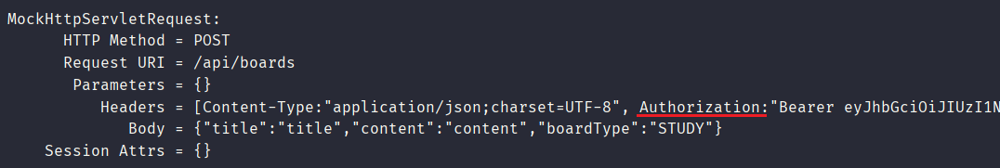
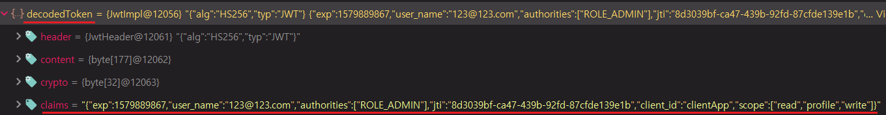
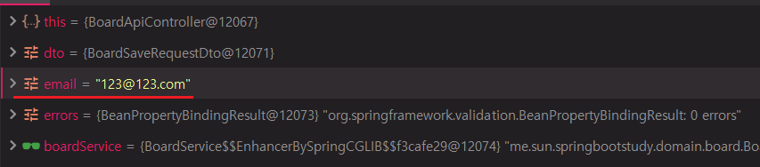

# JWT토큰 활용
> Spring, Vue를 통해 프로젝트를 개발하다가 현재 요청을 보내는 사용자가 누구인지 확인하는 방법이 있는지 고민을 해보았다.

> [OAuth2.0, JWT 게시글](https://sun-22.tistory.com/44) 에서 볼 수 있듯이 JWT의 PAYLOAD에는 Client의 정보가 들어있다. 스프링에서 JWT를 복호화해서 간편하게 가져오게 해주는 API가 있는지는 모르겠지만 경험삼아 직접 구현해보기로 하였다.

### RequestHeader

- 클라이언트에서 JWT 토큰을 Authorization Header에 담아 보내는것을 알 수 있다.
- 이 헤더를 컨트롤러에서 받아서 처리하면된다.

```java
@PostMapping
public ResponseEntity save(@RequestBody @Valid BoardSaveRequestDto dto,
                           @RequestHeader("Authorization") String jwtToken,
                           Errors errors) {}
```
- Controller에서 @RequestHeader를 통해 헤더요청에 대한 정보를 받을 수 있다.
- 하지만 필요한 컨트롤러 메서드에 모두 붙여줘야하고 일일히 디코드 해줘야 한다.
- HandlerMethodArgumentResolver를 이용해 한번 구현해보기로 하였다.


### TokenAnnotation
```java
@Target(ElementType.PARAMETER)
@Retention(RetentionPolicy.RUNTIME)
public @interface TokenMemberEmail {
}
```
- HandlerMethodArgumentResolver를 구현하기전에 annotation을 하나 만들었다.
- 이 Annotation이 있는 경우에만 HandlerMethodArgumentResolver가 동작하게 할 것이다.

### MethodArgumentResolver
```java
@Slf4j
@RequiredArgsConstructor
@Component
public class MemberEmailDecodeResolver implements HandlerMethodArgumentResolver {

    private final ObjectMapper objectMapper;

    @Override
    public boolean supportsParameter(MethodParameter parameter) {
        boolean isTokenMemberEmail = parameter.getParameterAnnotation(TokenMemberEmail.class) != null;
        boolean isString = String.class.equals(parameter.getParameterType());

        return isTokenMemberEmail && isString;
    }

    @Override
    public Object resolveArgument(MethodParameter parameter, ModelAndViewContainer mavContainer, NativeWebRequest webRequest, WebDataBinderFactory binderFactory) throws Exception {
        String authorizationHeader = webRequest.getHeader("Authorization");
        log.info("Authorization Header ::: " + authorizationHeader);

        if (authorizationHeader == null) {
            throw new NotHaveAccessTokenException("Access Token이 존재하지 않습니다.");
        }

        String jwtToken = authorizationHeader.substring(7);
        Jwt decodedToken = JwtHelper.decode(jwtToken);

        Map<String, String> claims = objectMapper.readValue(decodedToken.getClaims(), Map.class);
        String email = claims.get("user_name");

        log.info("Decoded email is ::: " + email);
        return email;
    }
}
```
supportsParameter
- resolveArgument를 수행할지 결정할 수 있는 메서드이다.
- true가 리턴되면 resolveArgument가 수행된다.
- 위에서 생성한 TokenMemberEmail Annoation과 파라미터의 타입이 String일 경우에만 resolveArgument를 수행시킨다.

resolveArgument
- webRequest를 통헤 Authorization헤더의 값을 받아온다.
- RequestHeader에서 실제 Authorization헤더에 들어있는 데이터를보면 실제 토큰앞에 Bearer가 존재하는것을 알 수 있다.
- 그렇기 때문에 그 부분을 제외하고 JwtHelper.decode를 통해 Jwt 타입으로 변환한다.



- decode된 Jwt를 디버깅해보면 claims에 모든 정보들이 들어있는 것을 알 수 있다.
- objectMapper로 간단하게 Map으로 매핑한 후 user_name 클레임을 가져올 수 있다.
- user_name에 나는 email을 넣었기 때문에 email정보가 들어 있을 것이다.

### ArgumentResolver 추가 및 사용
```java
@RequiredArgsConstructor
@Configuration
public class WebConfig implements WebMvcConfigurer {

    private final MemberEmailDecodeResolver memberEmailDecodeResolver;

    @Override
    public void addArgumentResolvers(List<HandlerMethodArgumentResolver> resolvers) {
        resolvers.add(memberEmailDecodeResolver);
    }
}
```
- 생성한 ArgumentResolver를 WebMvcConfigurer를 통해 추가해주어야 한다.

```java
@PostMapping
public ResponseEntity save(@RequestBody @Valid BoardSaveRequestDto dto,
                           @TokenMemberEmail String email,
                           Errors errors) {
}
```
- decode된 email 클레임을 받아오고 싶은 Controller 메서드에 @TokenMemberEmail String email을 통해 email을 받아올 수 있다.


- ArgumentResolver가 잘 동작하여 JWT 토큰을 decode해줘 token을 보내는 해당 유저의 emaild을 확인할 수 있게 되었다.
