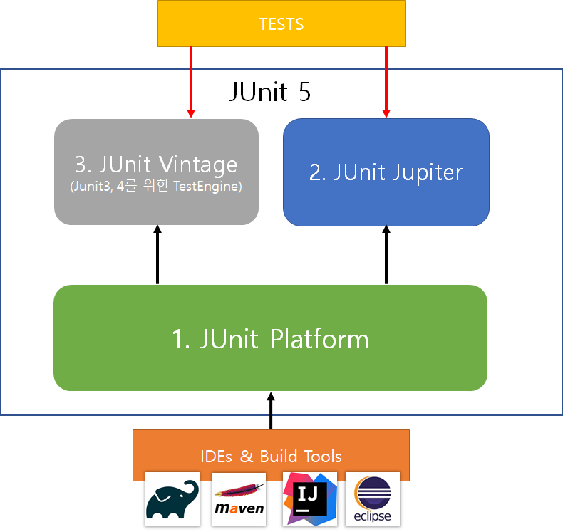
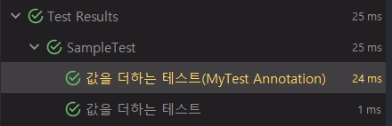

# JUnit5 #1

> [Junit5 User Guide](https://junit.org/junit5/docs/current/user-guide/#overview)를 읽어보면서 Junit5을 공부하는 게시글 입니다.

> 이번 게시글에서는 JUnit5의 특징과 라이프 사이클에 대해 알아보겠습니다.

### Junit5란?
- Junit5는 이전 버전과는 다르게 3가지의 서로다른 하위 프로젝트들로 구성되어 있습니다.
- 하위 프로젝트는 총 3개이며 아래와 같습니다.


- 우리가 작성하는 테스트 코드는 JUnit Vintage 혹은 JUnit Jupiter에 의해 실행되며 IDE나 Build Tool은 JUnit Platform을 통해 해당 테스트들을 구동시킵니다.

#### 1. JUnit Platform
- JVM위에서 테스트를 실행시키는 기반역할을 합니다.

#### 2. JUnit Jupiter
- JUnit5 기반의 테스트를 실행시키는 테스트 엔진을 제공합니다.

#### 3. JUnit Vintage
- JUnit3, 4기반의 테스트를 실행시키는 테스트 엔진을 제공합니다.

> JUnit5는 자바 8 이상의 런타임 환경을 요구하지만 이전 버전으로 컴파일돈 코드도 테스트 할 수 있습니다.

---
## 테스트 작성하기
#### 1. 의존성 추가 및 테스트 확인
```groovy
plugins {
    id 'java'
}

group 'me.sun'
version '1.0-SNAPSHOT'

sourceCompatibility = 1.8

repositories {
    mavenCentral()
}

dependencies {
    testImplementation('org.junit.jupiter:junit-jupiter:5.6.0')
}

test {
    useJUnitPlatform()
}
```
- 우선 gradle기반의 자바 프로젝트에서 jupiter를 추가해주고 JUnitPlatform을 설정합니다.

<br>

```java
import org.junit.jupiter.api.Test;

import static org.junit.jupiter.api.Assertions.assertEquals;

class SampleTest {
    @Test
    void sampleTest() throws Exception{
        assertEquals(10, sum(3, 7));
    }

    private int sum(int a, int b){
        return a + b;
    }
}
```
- JUnit5는 위와같이 class,와 method에 따로 public을 붙이지 않고 간단하게 테스트를진행할 수 있습니다.
- **public을 붙여도 되지만 private를 붙이면 테스트는 동작하지 않습니다.**

#### 2. Meta Annotaiton 사용
- JUnit Jupiter Annotation들은 meta-annotaiton으로 사용될 수 있습니다.

```java
@Target(ElementType.METHOD)
@Retention(RetentionPolicy.RUNTIME)
@DisplayName("값을 더하는 테스트(MyTest Annotation)")
@Test
public @interface MyTest {
}
```
- 즉 커스텀 애노테이션을 만들고 JUnit5 테스트에 적용시킬 수 있습니다.
- Test Annotaiton과 해당 테스트 이름을 설정해주는 DisplayName Annotation을 MyTest Annotaiton에 추가하였습니다.

<br>

```java
import org.junit.jupiter.api.DisplayName;
import org.junit.jupiter.api.Test;

import static org.junit.jupiter.api.Assertions.assertEquals;

class SampleTest {

    @Test
    @DisplayName("값을 더하는 테스트")
    void sampleTest() throws Exception{
        assertEquals(10, sum(3, 7));
    }


    @MyTest
    void tempTest() throws Exception{
        assertEquals(10, sum(3, 7));
    }


    private int sum(int a, int b){
        return a + b;
    }
}
```
- 해당 테스트를 실행시켜보면 아래와 같이 정상 동작하는 것을 확인할 수 있습니다.




#### 3. 테스트 클래스와 라이프사이클
- 우선 최상위의 테스트 클래스의 경우 최소 하나의 테스트 메서드를 가지고 있어야 합니다.
- 그리고 테스트 클래스는 abstract를 정의할 수 없으며 오직 파라미터가 없는 single constructor만 존재해야합니다.
- 아래에서는 테스트코드 라이프 사이클에 대해 확인해보겠습니다.
- 해당 라이프사이클은 상속 받은 클래스에도 적용될 수 있습니다.

```java
import org.junit.jupiter.api.*;

class SampleTest {

    @BeforeAll
    static void beforeAll(){
        System.out.println("=========================== Before All ===========================");
    }

    @BeforeEach
    void beforeEach(){
        System.out.println("---------------------------- Before Each ----------------------------");
    }

    @Test
    void sampleTest1() throws Exception{
        System.out.println(">>>>>>>>>>>>>>>>>>>> 테스트 1 <<<<<<<<<<<<<<<<<<<<");
    }


    @Test
    void sampleTest2() throws Exception{
        System.out.println(">>>>>>>>>>>>>>>>>>>> 테스트 2 <<<<<<<<<<<<<<<<<<<<");
    }


    @AfterEach
    void afterEach(){
        System.out.println("---------------------------- After Each ----------------------------");
    }

    @AfterAll
    static void afterAll(){
        System.out.println("=========================== After All ===========================");
    }
}


// ============================ 출력 ==========================
=========================== Before All ===========================

---------------------------- Before Each ----------------------------
>>>>>>>>>>>>>>>>>>>> 테스트 1 <<<<<<<<<<<<<<<<<<<<
---------------------------- After Each ----------------------------


---------------------------- Before Each ----------------------------
>>>>>>>>>>>>>>>>>>>> 테스트 2 <<<<<<<<<<<<<<<<<<<<
---------------------------- After Each ----------------------------

=========================== After All ===========================
```
- BeforeAll은 테스트 실행 시 해당 테스트 클래스의 최초를 뜻하고 AfterAll은 최후를 뜻합니다.
- 해당 테스트 둘은 static 메서드로 작성하여야 테스트가 적용됩니다.
- 각 Each는 각 테스트 마다 적용되는 메서드입니다.

**테스트 클래스 상속**
```java
public class TempTest extends SampleTest {

    @Test
    void tempTest() throws Exception{
        System.out.println("tempTest");
    }

}

// =========================== 출력 ===========================
---------------------------- Before Each ----------------------------
tempTest
---------------------------- After Each ----------------------------
```
- 위에서 설명 드렸듯이 테스트 클래스를 상속받으면 상속받은 클래스도 부모의 라이프사이클이 사용되는것을 확인할 수 있습니다.

---


#### 4. Assertions
- JUnit5 Jupiter의 Assertions Method들에는 JUnit의 Assertions의 많은 메서드들이 포함되어 있고 람다를 활용한 추가적인 기능을 제공합니다.
- 모든 메서드는 org.junit.jupiter.api.Assertions의 static 메서드로 정의되어 있습니다.
- 먼저 테스트 실패시 메시지에 대해 알아보겠습니다.

**테스트 실패 시 메시지**
```java
class SampleTest {
    @Test
    void sampleTest() throws Exception{

        int num1 = 3;
        int num2 = 6;

        assertTrue(num1 > num2 , num1 + " > " + num2 + "를 만족해야 합니다.");
        assertTrue(num1 > num2 , () -> num1 + " > " + num2 + "를 만족해야 합니다.");
    }
}
```
- 테스트코드를 보시면 첫번째의 경우 마지막 파라미터를 변수로 넘겨줬지만 두번째는 람다식을 활용하여 함수로 넘겨준것을 알 수 있습니다.
- 람다식으로 넘겨줄 경우 해당 + 연산은 테스트가 실패시 동작하므로 조금의 성능을 향상 시킬 수 있습니다.
- 다음으로는 해당 인스턴스의 변수들을 한번에 테스트하는 방법에 대해 알아보겠습니다.

**그룹 테스트**
```java
public class Member {
    private String name;
    private int age;

    public Member(String name, int age) {
        this.name = name;
        this.age = age;
    }

    public String getName() {
        return name;
    }

    public int getAge() {
        return age;
    }
}
```
- 우선 멤버 클래스를 하나 정의하겠습니다.

```java
import org.junit.jupiter.api.Test;

import static org.junit.jupiter.api.Assertions.*;

class SampleTest {

    private final Member member = new Member("Dexter", 20);

    @Test
    void sampleTest() throws Exception {

        // =========================== 인스턴스의 변수 테스트하기 =============================
        assertAll("member test",
                () -> assertEquals(member.getName(), "Dexter"),
                () -> assertEquals(member.getAge(), 20)
        );

        // =========================== 인스턴스의 변수 각각 테스트하기 =============================
        assertAll("member properties test",
                () -> {
                    String name = member.getName();
                    assertNotNull(name);

                    assertAll("name of member",
                            () -> assertTrue(name.startsWith("Dex")),
                            () -> assertTrue(name.endsWith("ter"))
                    );
                },
                () -> {
                    int age = member.getAge();

                    assertAll("age of member",
                            () -> assertTrue(age > 15),
                            () -> assertFalse(age < 18),
                            () -> assertTrue(age < 21)
                    );
                }
        );
    }
}
```
- 20살의 Dexter라는 Member를 만들고 해당 인스턴스에 대한 테스트를 진행합니다.
- assertAll의 첫번째 파라미터는 heading으로 테스트 실패시 나타낼 수 있는 heading을 정의할 수 있습니다.
- 그 후 람다식을 이용하여 각 그룹의 테스트들을 정의할 수 있습니다.
- 첫번째 assertAll에서와 같이  member들의 인스턴스 변수를 assertAll안에서 테스트하였습니다.
- 두번째 assertAll에서는 각 변수들의 데이터들을 이용하여 또 assertAll을 사용하여 테스트할 수 있음을 알 수 있습니다.


---
