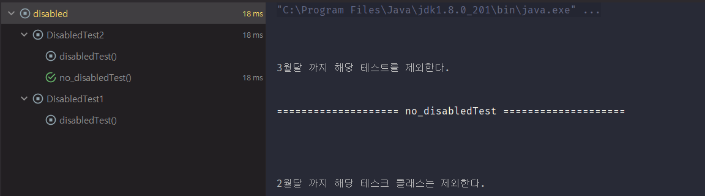
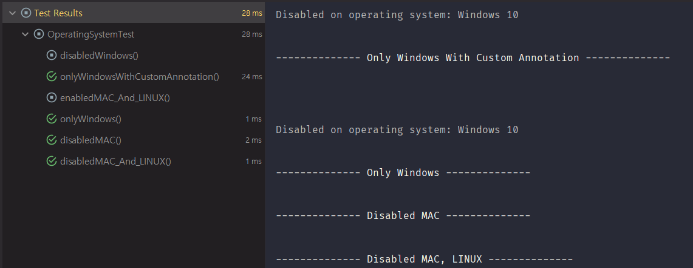
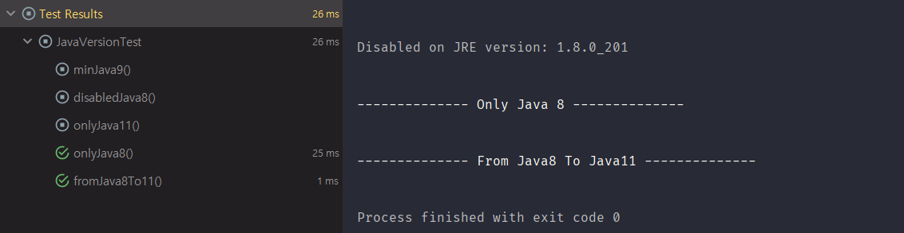

# JUnit5 #2

> [Junit5 User Guide](https://junit.org/junit5/docs/current/user-guide/#overview)를 읽어보면서 Junit5을 공부하는 게시글 입니다.

> 이번 게시글에서는 JUnit5의 Assertions, Assumptions, Conditional Test등에 대해 알아보겠습니다.

### 1. Assertions
- JUnit5 Jupiter의 Assertions Method들에는 JUnit4의 Assertions의 많은 메서드들이 포함되어 있고 람다를 활용한 추가적인 기능을 제공합니다.
- 모든 메서드는 org.junit.jupiter.api.Assertions의 static 메서드로 정의되어 있습니다.
- 먼저 테스트 실패시 메시지에 대해 알아보겠습니다.

#### 1) 테스트 실패 시 메시지
```java
class SampleTest {
    @Test
    void sampleTest() throws Exception{

        int num1 = 3;
        int num2 = 6;

        assertTrue(num1 > num2 , num1 + " > " + num2 + "를 만족해야 합니다.");
        assertTrue(num1 > num2 , () -> num1 + " > " + num2 + "를 만족해야 합니다.");
    }
}
```
- 테스트 실패 시 나타낼 메시지는 첫번째 assertTrue와 같이 단순 파라미터로 넘겨주거나, 두번째 assertTrue처럼 람다식을 활용하여 함수로 넘겨 줄 수 있습니다.
- 람다식으로 넘겨줄 경우 해당 + 연산은 **테스트 실패시** 동작하므로 조금의 성능을 향상 시킬 수 있습니다.
- 다음으로는 해당 인스턴스의 변수들을 한번에 테스트하는 방법에 대해 알아보겠습니다.

#### 2) 그룹 테스트
```java
public class Member {
    private String name;
    private int age;

    public Member(String name, int age) {
        this.name = name;
        this.age = age;
    }

    public String getName() {
        return name;
    }

    public int getAge() {
        return age;
    }
}
```
- 우선 멤버 클래스를 하나 정의하겠습니다.

```java
import org.junit.jupiter.api.Test;

import static org.junit.jupiter.api.Assertions.*;

class SampleTest {

    private final Member member = new Member("Dexter", 20);

    @Test
    void sampleTest() throws Exception {

        // =========================== 인스턴스의 변수 테스트하기 =============================
        assertAll("member test",
                () -> assertEquals(member.getName(), "Dexter"),
                () -> assertEquals(member.getAge(), 20)
        );

        // =========================== 인스턴스의 변수 각각 테스트하기 =============================
        assertAll("member properties test",
                () -> {
                    String name = member.getName();
                    assertNotNull(name);

                    assertAll("name of member",
                            () -> assertTrue(name.startsWith("Dex")),
                            () -> assertTrue(name.endsWith("ter"))
                    );
                },
                () -> {
                    int age = member.getAge();

                    assertAll("age of member",
                            () -> assertTrue(age > 15),
                            () -> assertFalse(age < 18),
                            () -> assertTrue(age < 21)
                    );
                }
        );
    }
}
```
- 20살의 Dexter라는 Member를 만들고 해당 인스턴스에 대한 테스트를 진행합니다.
- assertAll의 첫번째 파라미터는 heading으로 테스트 실패시 나타낼 수 있는 heading을 정의할 수 있습니다.
- 그 후 람다식을 이용하여 각 그룹의 테스트들을 정의할 수 있습니다.
- 첫번째 assertAll에서와 같이  member들의 인스턴스 변수를 assertAll안에서 테스트하였습니다.
- 두번째 assertAll에서는 각 변수들의 데이터들을 이용하여 또 assertAll을 사용하여 테스트할 수 있음을 알 수 있습니다.

#### 3) 예외 테스트
```java
@Test
void exceptionTest() throws Exception {
    List<String> tempList = new ArrayList<>();
    Exception exception = assertThrows(IndexOutOfBoundsException.class, () -> tempList.get(3));
    assertEquals("Index: 3, Size: 0", exception.getMessage());
}
```
- assertThrows를 통해 예외 테스트가 가능합니다.
- 그리고 해당 예외를 받아 예외 메시지에대한 검증도 진행할 수 있습니다.

#### 4) 시간 제한 테스트
```java
@Test
void timeoutTest() throws Exception{
    String result = assertTimeout(Duration.ofSeconds(2), () -> {
        Thread.sleep(1900);
        return "timeout test success!";
    });
    assertEquals("timeout test success!", result);
}

@Test
void timeoutTest2() throws Exception{
    String result = assertTimeout(Duration.ofSeconds(2), () -> {
        Thread.sleep(3000);
        return "timeout test fail!";
    });
    assertEquals("timeout test fail!", result);
}
```
- assertTimeout을 통해 시간테스트도 가능합니다.
- 첫번째 테스트 경우 2초내외로 해당 결과가 반환되므로 해당 테스트는 성공합니다.
- 허나 두번째 테스트는 시간이 초과되었으므로 아래와 같은 메시지와 함께 테스트가 실패합니다.

```java
org.opentest4j.AssertionFailedError: execution exceeded timeout of 2000 ms by 1001 ms
```

#### 5) Third-Party 라이브러리
- JUnit Jupiter도 많은 기능을 제공하지만 필요에 따라 더 가독성있고 유연한 기능들을 제공하는 AssertJ, Hamcrest등 써드파티 라이브러리를 사용하는 것을 Guide에서도 권장한다고 합니다.

> 개인적으로 AssertJ가 가독성이 좋고 사용하기 편하다고 생각하기때문에 JUnit5의 이외의 기능들을 알아본 후에 AssertJ 가이드를 공부해볼 생각입니다.

---

### 2. Assumptions
- Assertions와 마찬가지로 JUnit5 Jupiter에서는 Assumptions Method들에는 JUnit4의 Assumptions의 많은 메서드들이 포함되어 있고 람다를 활용한 추가적인 기능을 제공합니다.
- 모든 메서드는 org.junit.jupiter.api.Assumptions의 static 메서드로 정의되어 있습니다.

```java
@Test
void environmentTest() throws Exception {
    int num1 = 1;
    int num2 = 2;

    assumingThat(num1 != num2, () -> {
        assertFalse(num1 == num2);
    });

}
```
- 간단하게 해당 조건에 맞을시에만 원하는 테스트를 진행할 수 있습니다.

---

### 3. Disabling Test
- Disabled Annotation을 통해 특정 테스트 클래스 혹은 메서드들을 테스트에서 제외 시킬 수 있습니다.

```java
@Disabled("2월달 까지 해당 테스크 클래스는 제외한다.")
class DisabledTest1 {
    @Test
    void disabledTest() throws Exception{
        System.out.println("==================== disabledTest ====================");
    }
}


class DisabledTest2 {

    @Disabled("3월달 까지 해당 테스트를 제외한다.")
    @Test
    void disabledTest() throws Exception{
        System.out.println("==================== disabledTest ====================");
    }

    @Test
    void no_disabledTest() throws Exception{
        System.out.println("==================== no_disabledTest ====================");
    }
}
```
- DisabledTest1는 해당 클래스 자체를 Disabled시켰으므로 클래스 내의 모든 테스트는 제외됩니다.
- DisabledTest2는 해당 테스트 하나만 Disabled시켰으므로 해당 테스트만 제외됩니다.


- 결과를 확인해보면 정상적으로 테스트가 제외되고 제외메시지가 나타나는것을 알 수 있습니다.

---

### 4. Conditional Test Execution
- org.junit.jupiter.api.condition이하의 Annotation을 통해 다양한 환경에 맞게 테스트를 활성화 혹은 비활성화 시킬 수 있습니다.
- 간단하게 운영체제, 자바 버전별에 따라 활성, 비활성이 가능합니다.

#### 1) 운영체제별 테스트 수행
```java
import org.junit.jupiter.api.Test;
import org.junit.jupiter.api.condition.DisabledOnOs;
import org.junit.jupiter.api.condition.EnabledOnOs;
import org.junit.jupiter.api.condition.OS;

class OperatingSystemTest {

    @Test
    @EnabledOnOs(OS.WINDOWS)
    void onlyWindows() throws Exception{
        System.out.println("-------------- Only Windows --------------");
    }

    @TestOnWindows
    void onlyWindowsWithCustomAnnotation() throws Exception{
        System.out.println("-------------- Only Windows With Custom Annotation --------------");
    }

    @Test
    @DisabledOnOs(OS.WINDOWS)
    void disabledWindows(){
        System.out.println("-------------- Disabled Windows --------------");
    }

    @Test
    @DisabledOnOs(OS.MAC)
    void disabledMAC(){
        System.out.println("-------------- Disabled MAC --------------");
    }

    @Test
    @DisabledOnOs({OS.MAC, OS.LINUX})
    void disabledMAC_And_LINUX(){
        System.out.println("-------------- Disabled MAC, LINUX --------------");
    }

    @Test
    @EnabledOnOs({OS.MAC, OS.LINUX})
    void enabledMAC_And_LINUX(){
        System.out.println("-------------- Enabled MAC, LINUX --------------");
    }

}

// Custom Annotation
@Target(ElementType.METHOD)
@Retention(RetentionPolicy.RUNTIME)
@Test
@EnabledOnOs(OS.WINDOWS)
public @interface TestOnWindows {
}

```
- DisabledOnOs, EnabledOnOs를 통해 운영체제에 맞게 테스트를 동작시킬 수 있습니다.
- 두번째 테스트는 저번 게시글에서 확인했듯이 Jupiter Annotaiton은 Meta Annotaiton으로 활용이 가능하므로 커스텀할 수 있습니다.
- 저는 현재 Windows 운영체제이므로 아래와 같이 Windows가 테스트될 수 없게 설정된것들은 테스트되지 않은것을 확인할 수 있습니다.



#### 2) 자바 버전별 테스트 수행
```java
class JavaVersionTest {
    @Test
    @EnabledOnJre(JRE.JAVA_8)
    void onlyJava8(){
        System.out.println("-------------- Only Java 8 --------------");
    }

    @Test
    @DisabledOnJre(JRE.JAVA_8)
    void disabledJava8(){
        System.out.println("-------------- Disabled Java 8 --------------");
    }


    @Test
    @EnabledOnJre(JRE.JAVA_11)
    void onlyJava11(){
        System.out.println("-------------- OnlyJava 11 --------------");
    }

    @Test
    @EnabledForJreRange(min = JRE.JAVA_8, max = JRE.JAVA_11)
    void fromJava8To11(){
        System.out.println("-------------- From Java8 To Java11 --------------");
    }

    @Test
    @EnabledForJreRange(min = JRE.JAVA_9)
    void minJava9(){
        System.out.println("-------------- Min Java 9 --------------");
    }
}
```
- EnabledOnJre(Range), DisabledOnJre Annotation을 통해 자바 버전별 테스트를 수행할 수 있습니다.
- OnJre의 경우 해당 버전에 대해 활성, 비활성이 가능합니다.
- JreRange의 경우 버전에 대한 범위 지정, 최소, 최대 적용 버전등을 지정할 수 있습니다.
- 저는 현재 자바 8을 사용하기 있기 때문에 아래와 같이 자바8에 해당하는 테스트만 수행된 것을 확인할 수 있습니다.



---

### 5. Test Execution Order
- 한 클래스트내에서 여러개의 테스트를 실행해보면 테스트 순서가 일정하지 않은것을 확인할 수 있습니다.

```Java
class OrderTest {

    @Test
    void first() throws Exception{
        System.out.println("-------------------- First --------------------");
    }

    @Test
    void second() throws Exception{
        System.out.println("-------------------- Second --------------------");
    }


    @Test
    void third() throws Exception{
        System.out.println("-------------------- Third --------------------");
    }

    @Test
    void fourth() throws Exception{
        System.out.println("-------------------- Fourth --------------------");
    }

}

// ========================= 출력 =========================
-------------------- Fourth --------------------
-------------------- Second --------------------
-------------------- First --------------------
-------------------- Third --------------------
```
- 이 테스트를 실행해보면 테스트 순서가 일정치 않은것을 알 수 있습니다.
- 출력을 봐도 순서가 뒤죽박죽인것이 확인됩니다.
- 이럴때 Order Annotaiton을 사용하면 테스트 순서를 지정할 수 있습니다.
- 보통 통합 테스트시 이러한 기능이 필요할 것으로 생각됩니다.

<br>

```Java
@TestMethodOrder(MethodOrderer.OrderAnnotation.class)
class OrderTest {

    @Order(-100)
    @Test
    void first() throws Exception{
        System.out.println("-------------------- First --------------------");
    }

    @Order(0)
    @Test
    void second() throws Exception{
        System.out.println("-------------------- Second --------------------");
    }

    @Order(10)
    @Test
    void third() throws Exception{
        System.out.println("-------------------- Third --------------------");
    }

    @Order(100)
    @Test
    void fourth() throws Exception{
        System.out.println("-------------------- Fourth --------------------");
    }

}

// ========================= 출력 =========================
-------------------- First --------------------
-------------------- Second --------------------
-------------------- Third --------------------
-------------------- Fourth --------------------
```
- 먼저 Test class에 @TestMethodOrder를 통해 OrderAnnotation.class를 사용하도록 설정합니다.
- Default값은 Random.class이므로 해당 순서가 일정하지 않은 것입니다.
- 알파벳으로 순서를 정하는 class도 존재하지만 Order만으로 충분해 보입니다.

---

### 6. Nested Tests
- 테스크 클래스의 내부 클래스를 정의할 때 필요한 Annotation입니다.
- 내부 클래스이므로 static 지정이 불가능하기때문에 BeforeAll, AfterAll선언은 불가능합니다.
- 단 테스트 인스턴스 생명주기를 Method단위가 아닌 Class단위로 설정하면 사용이 가능합니다.
- 해당게시글에서는 인스턴스 생명주기까지는 바꾸지않고 기본 내부 클래스 정의를 해보겠습니다.

```Java
class NestedTest {

    private List<Integer> list;

    @BeforeEach
    void initData() throws Exception{
        list = new ArrayList<>();
    }

    @Nested
    class Inner{
        @BeforeEach
        void beforeEach_Inner(){
            list.add(1);
            list.add(2);
        }
        @Test
        void indexOutOf() throws Exception{
            assertThrows(IndexOutOfBoundsException.class, () -> list.get(10));
        }
        @Test
        void sizeCheck() {
            assertEquals(2, list.size());
        }

        @Nested
        class InnerInner{
            @BeforeEach
            void beforeEach_Inner_Inner(){
                list.remove(1);
                list.remove(0);
            }
            @Test
            void sizeCheck_inner_inner(){
                assertEquals(0, list.size());
            }

            @Test
            void indexOutof(){
                assertThrows(IndexOutOfBoundsException.class, () -> list.get(0));
            }
        }
    }

}
```
- NestedTest class에 Inner와 Inner의 InnerInner class가 존재합니다.
- 해당 테스트는 모두 성공하는 테스트이므로 테스트는 외부 클래스에서 내부 클래스로 순서대로 진행되는것을 확인할 수 있습니다.
